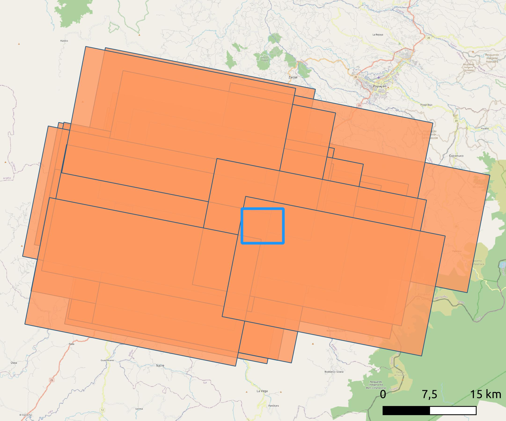
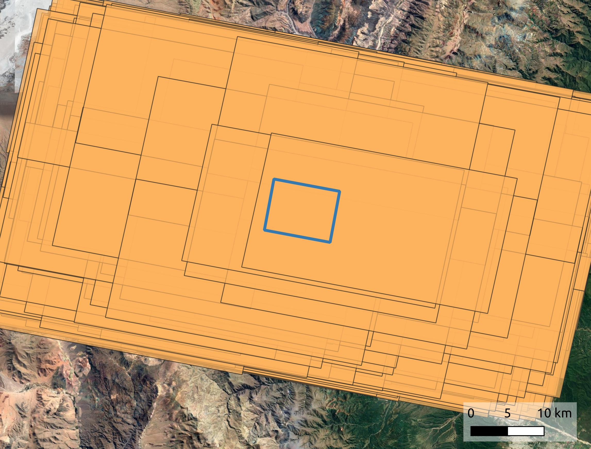
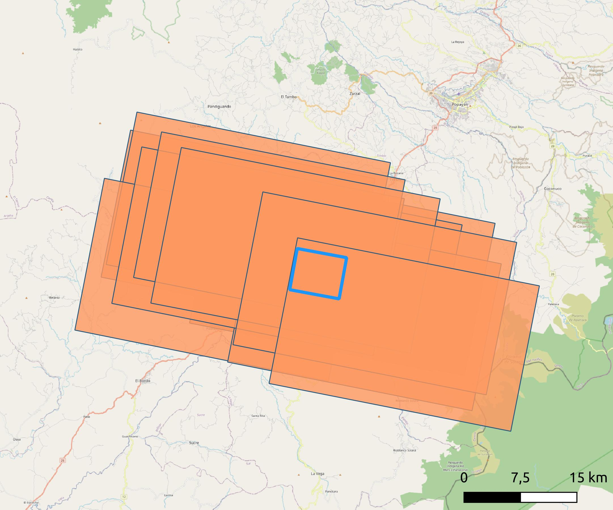
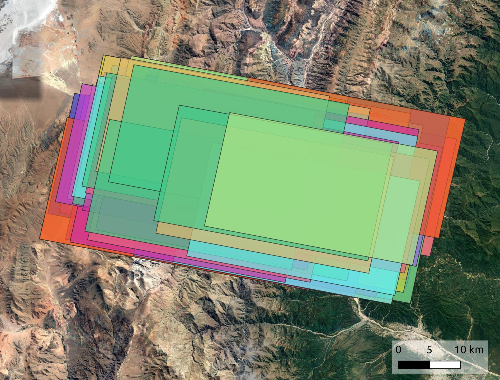

# Tutorial 1: Searching for PlanetScope data

This tutorial walks you through the data selection process to find PlanetScope L3B data acquired from common satellite perspectives. We will access and search the PlanetScope online catalog via the [Planet Software Development Kit (SDK) for Python](https://github.com/planetlabs/planet-client-python) and refine the search to form groups of images with common satellite perspective. Please make sure that you have authenticated with the Planet server using your Planet account (see [Documentation](https://planet-sdk-for-python-v2.readthedocs.io/en/latest/get-started/quick-start-guide/#step-4-sign-on-to-your-account). Note: The result will be a recommendation of scenes to download. You can download these automatically via the Planet API, however, I do recommend to check all imagery visually in the [Planet Explorer](https://www.planet.com/explorer/), to make sure your target is not cloud covered.

## Step 1: Draw your area of interest (AOI)
Create a polygon that constrains your area of interest and store it as a GeoJSON. You can use QGIS for this. Make sure to cover a substantial amount of stable terrain surrounding your moving target and use EPSG:4326 as a coordinate reference system.  

## Step 2: Conduct a rough search
All functions related to data search are stored under `planet_search_functions.py`. Here is an example for a first-order search for PlanetScope data acquired between March 2020 and June 2023 by PSB.SD instruments over the given AOI:
``` python
import planet_search_functions as search
aoi = "./tutorial/test_aoi.geojson"

searchfile = search.search_planet_catalog(instrument = "PSB.SD", aoi = aoi, cloud_cover_max=0.1, date_start = "2020-03-01", date_stop = "2023-06-30")
```
Executing this code will provide you with a new GeoJSON file (search.geojson) that stores the footprints and metadata of all scenes that match your filter criteria. You can open this in QGIS:



## Step 3: Refine your AOI (optional)
If you have drawn a rectangular AOI like me, you may want to adjust it to the scan line direction of the PlanetScope data. This increases the chances of a scene to cover the full AOI which will be filter criteria in the subsequent step. To rotate your polygon, you can use the Geometry Edit tools in QGIS. Save your edits and then rerun the search.



## Step 4: Filter by AOI coverage and convert to pandas DataFrame

You may have noticed that the search via the Planet SDK has also included scenes that just barely touch the AOI. These will not be very useful for cross correlation. To search for scenes that have a significant amount of overlap with your AOI (99% in this case), run the following:

``` python
scenes = search.refine_search_and_convert_to_csv(searchfile, aoi = aoi, instrument = instrument, min_overlap = 99)
```

This will select the scenes obtained from your initial search that have at least a 99% overlap with the AOI. Scene IDs and acquisition parameters of relevant scenes will be stored as a pandas DataFrame which is useful for further processing. Additionally, the search.geojson file will be updated to only contain scenes that match the new filter criteria. 



Note: you can also use `refine_search_and_convert_to_csv` to filter for a common orbit, however, this will only be relevant for the older PS2 sensors.  

## Step 5: Find groups based on similar satellite perspective

If you plan on using orthorectified L3B data for offset tracking across changing terrain, correlation pairs should be acquired from a common satellite perspective to minimize the bias from orthorectification errors. To get a suggestion for individual correlation based on similar view and satellite azimuth angles, execute the following: 

``` python
groups = search.find_common_perspectives(scenes, va_diff_thresh = 0.6, min_group_size = 5, min_dt = 30, searchfile = searchfile)
```

Here, I use the previously obtained DataFrame to form groups that have a minimum size of five PlanetScope acquisitions. As a threshold for true view angle difference (considering view angle and look direction), I choose 0.6°. You may also require a minimal temporal baseline between acquisitions in a single group, which I set to 30 days in this case. If you provide the name of your searchfile (search.geojson) this will be updated to only contail images that were assigned to a group. The group ID of a feature will be written to the attribute table. 



## Step 6: Download your data via the [Planet Explorer](https://www.planet.com/explorer/)

As mentioned earlier, I recommend to visually inspect the suggested scenes in the [Planet Explorer](https://www.planet.com/explorer/) to ensure that your AOI is completely cloud free. Then download the data. For L3B, I worked with Surface Reflectance – 4 band from the rectified assets. 

