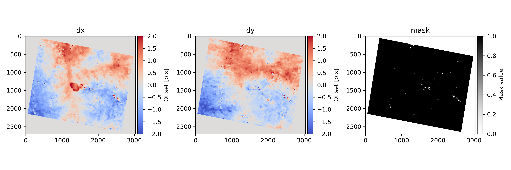
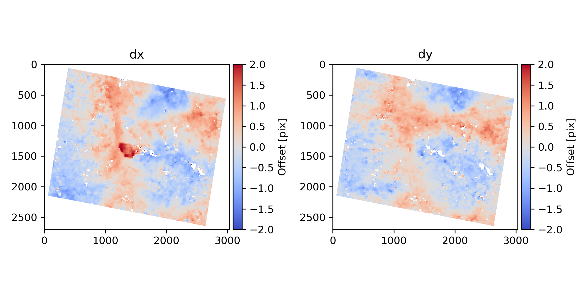
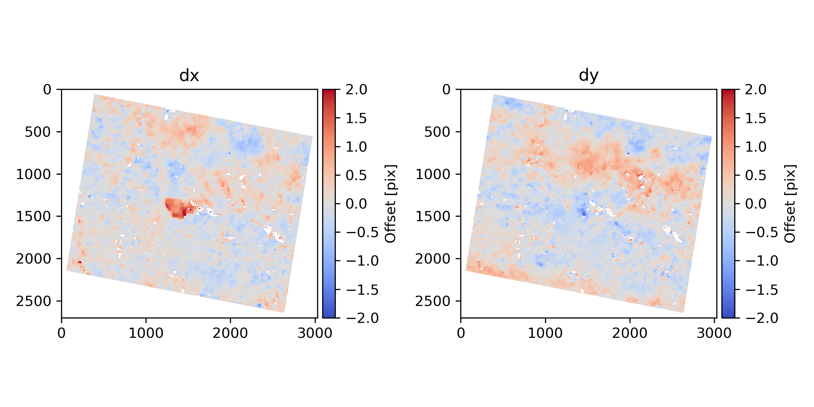
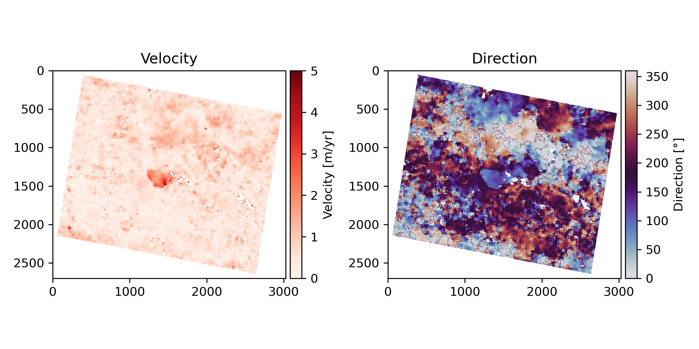

# Tutorial 2: Offset tracking with L3B data

In this tutorial, we will use the downloaded PlanetScope L3B data to retrieve disparity maps and estimate landslide velocity. The necessary processing steps are (1) isolate bands, (2) determine correlation pairs, (3) correlate data, (4) apply polynomial fit, and (5) calculate velocity. 

## Step 1: Isolate green band

The correlation with ASP can only be carried out for single-band images. Technically, a pseudo-panchromatic image could be generated from all RGB bands, however, due to inter-band misalignment we recommend to work with a single band only. To isolate bands use the functions collected under `preprocessing_functions.py`:

``` python
import preprocessing_functions as preprocessing
import glob

work_dir = "./tutorial"

#get a list of all multiband TIFF files that you downloaded
files = glob.glob("/path/to/downloaded/scenes/jobname_psscene_analytic_sr_udm2/PSScene/*3B_AnalyticMS_SR_clip.tif") 
preprocessing.get_single_band(files, out_path = work_dir, band_nr = 2)
```

Here, I select all scenes in the folder containing the downloaded PlanetScope data (be sure to modify the path accordingly) and then extract the green band (band 2) from the multi-band raster. All output images will be saved in my working directory.

## Step 2: Find correlation pairs 

You have a couple of options to generate a matchfile (file storing correlation pairs of reference and secondary scenes). The easiest option is to provide the path to a directory were you have stored the data you want to correlate. Then you can match all files in there like this: 


``` python
matches = preprocessing.match_all(work_dir, ext = "_b2.tif", dt_min = 180)
```

This function collects all files with the extension *_b2.tif in the provided directory and forms correlation pairs. To ensure sufficient displacement for detection, a minimum temporal baseline of 180 days is required between the acquisition of both scenes. The specific value depends on the velocity of the investigated target. It's important to note that the function only matches older scenes with newer acquisitions, preventing any duplicate pairs where both A B and B A are considered. Also, this function does not consider true view angle difference, so you need to ensure that only scenes acquired from a common perspective are in the provided directory.

Alternatively, you can also use the pandas DataFrames obtained from searching the Planet catalog (see [Tutorial 1](./Tutorial1_Data_Search.md)) for building a matchfile. This works with or without downloaded data. If you do not check for existing files, the function will provide you with the IDs from potential matches. This information can be useful for determining the approximate number of correlation pairs you would have to process when working with the filtered scenes. Else you will obtain a dataframe (and csv file) storing full filenames of reference and secondary images.

``` python
#Example for matching based on search df  
matches = preprocessing.generate_matchfile_from_search(df, dt_min = 180)
#Example for matching based on search df and checking for existing files in the provided directory
matches = preprocessing.generate_matchfile_from_search(df, dt_min = 180, path = work_dir, check_existence=True)

#Example for matching based on group df  
matches = preprocessing.generate_matchfile_from_groups(groups, dt_min = 180)
#Example for matching based on group df and checking for existing files in the provided directory
matches = preprocessing.generate_matchfile_from_groups(groups, dt_min = 180, path = work_dir, check_existence=True)
```

Finally, there is also a function to that finds the true view angle difference between potential matches – in case you want to manually select scene pairs and not automatically form groups as suggested in the [first Tutorial](./Tutorial1_Data_Search.md). All you need to provide is the DataFrame obtained from searching the Planet catalog and the matches you want to evaluate:

``` python
ratings = preprocessing.rate_match(scenes, matches) 
```

## Step 3: Correlate data

To correlate the matched scenes, we will use the functionalities from [Ames Stereo Pipeline](https://stereopipeline.readthedocs.io/en/latest/index.html). I have written some wrappers around the original command line tools, so that you can run the correlation from Python as a subprocess. Make sure to provide the path to the bin directory of your ASP installation:

``` python
import asp_helper_functions as asp

amespath = "/your/path/StereoPipeline-3.1.1-date-x86_64-Linux/bin"
dmaps = asp.correlate_asp_wrapper(amespath, matches, sp_mode = 2, corr_kernel = 35, prefix_ext = "_L3B")
```

Running this will take a moment, depending on the number of image pairs and correlation parameters you used. Subpixel mode 2 (Bayes EM weighting) produces best results but takes longest. Use subpixel mode 3 for a trade-off between runtime and accuracy. Subpixel mode 1 (parabola fitting) should only be used for a rough overview - the measurements are not precise. 
When it is done, the function will return a list of filenames of the newly generated disparity maps. You will find them in the same directory as your image data in a subfolder called `disparity_maps`.
Filtered disparity maps are 3-band GeoTIFF files with the first band representing the displacement in East-West direction (dx), the second band North-South (dy), and the third a good pixel mask. Files are named after the following convention: `[id_img1]_[id_img2][prefix_ext]-F.tif`. The prefix extension will by default be empty, however, I can recommend to give some meaningful name, so you know which data were correlated. Here are the offset-tracking results for an exemplary image pair:


## Step 4: Apply polynomial fit

As you can see, the disparity map still contains systematic erroneous displacement signals related to stereoscopic effects and ramp errors. To mitigate these, you can apply a polynomial fit. All necessary functions are stored under `optimization_functions.py`. The apply_polyfit() function support fitting of of polynomials (orders 1-3) based on X and Y grid positions: 

``` python
import optimization_functions as opt

dmaps_pfit = opt.apply_polyfit(matches, prefix_ext= "_L3B", order = 2)
```


You can see that this efficiently removed ramp errors, however, the stereoscopic effects are still present. You can model these with an external Digital Elevation Model (DEM). Select a DEM that was acquired as close to the acquisition of the PlanetScope data as possible. If major elevation changes have occurred since the acquisition of the Copernicus DEM, you can create a reference model from PlanetScope data itself (see Tutorial 3). 

``` python
demname = "/path/to/a/DEM.tif"
dmaps_pfit = opt.apply_polyfit(matches, prefix_ext= "_L3B", order = 2, demname = demname)
```


All adjusted disparity maps will be stored in the same directory as the original filed under the name `[id_img1]_[id_img2][prefix_ext]_polyfit-F.tif`. These files do no longer contain a band for the pixel mask, as it has been applied to mask unreliable measurements and areas with nodata directly to dx and dy displacements. 

## Step 5: Calculate velocity

To translate the derived disparities into annual velocities, you can use `calc_velocity_wrapper()` from `postprocessing_functions.py`:
``` python
import postprocessing_functions as postprocessing

vels = postprocessing.calc_velocity_wrapper(matches, prefix_ext = "_L3B_polyfit")
```
Note that you will have to add "_polyfit" to the prefix extension in order for the corrected files to be taken as input. Else the velocity calculation will be based on the original disparity maps. The function will calculate velocity and direction for the provided matches. The output will be stored as a 2-band raster called `[id_img1]_[id_img2][prefix_ext]_polyfit-F_velocity.tif` with the first band being the annual velocity and the second band the direction of displacement in degrees:


## Other functionalities

To stack all obtained velocity measurements (or disparity maps), you can use: 
``` python
stack = postprocessing.stack_rasters(matches, prefix_ext = "_L3B_polyfit", what = "velocity")
```
This will return the path to a 2-band GeoTIFF file storing the mean (first band) and standard deviation (second band) of the velocities from all stacked files. 

