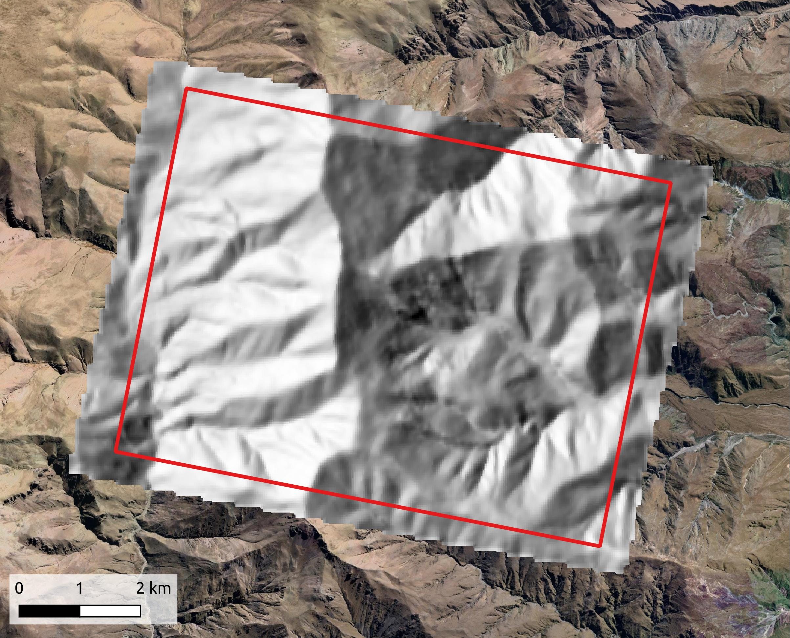
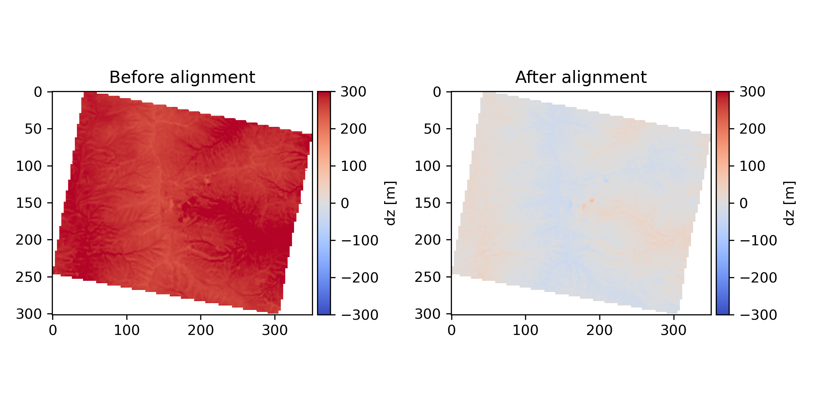

# Tutorial 4: DEM building with PlanetScope L1B data and Ames Stereo Pipeline

This tutorial explains how you can use PlanetScope L1B data to generate a low-resolution (30 m) digital elevation model (DEM). A PlanetScope DEM can help to better model the Earth's surface at time of image acquisition and thus reduce the orthorectification errors in disparity maps derived from scenes acquired from variable perspectives. Tools for stereo correlation are part of the [Ames Stereo Pipeline](https://stereopipeline.readthedocs.io/en/latest/index.html).

## Step 1: Data selection

Contrary to before, it is essential to select an image pair with large perspective difference to maximize the parallax in the obtained disparity maps. This means you want to search for images with a large true view angle difference (ideally 10°). Also ensure that the images were acquired as close in time as possible, so you can minimize the bias introduced by changing terrain (e.g. through vegetation) or illumination conditions (different seasons). Also, I recommend to not use PSB.SD acquisitions from early 2020, as these may be affected by sub-frame misalignment resulting in significant stripe artifacts. You can use the `suggest_dem_pairs()` function from `planet_search_functions.py` to get a dataframe containing suggestions for suitable image pairs. Inspect and download a pair of your choice via the Planet Explorer](https://www.planet.com/explorer/).

``` python
import planet_search_functions as search
searchfile = search.search_planet_catalog(instrument = instrument, aoi = dem_aoi, cloud_cover_max=0.1, date_start = "2020-03-01", date_stop = "2023-06-30")
scenes = search.refine_search_and_convert_to_csv(searchfile, aoi = dem_aoi, instrument = instrument, min_overlap = 99)
pairs = search.suggest_dem_pairs(scenes, min_va = 5, max_dt = 30)
```

## Step 2: DEM generation

Once you have downloaded two suitable scenes, you can perform stereo correlation and triangulation. The whole process, including bundle adjustment, initial DEM building, mapprojection and final stereo correlation can be executed by running `dem_building()` from `asp_helper_functions.py`. As input, you will need to provide the path to your ASP installation, two images with large perspective differences and an EPSG code for the target CRS. Warning: Stereo correlation takes long, especially since it is run twice and using Bayes EM weighting for sub-pixel refinement to ensure highest quality. You can run it locally, but if you have access to a server with many cores, I recommend to move the process there. To reduce the runtime a little bit, constrain the stereo correlation to your AOI by providing a GeoJSON. Make sure that the DEM aoi is slightly larger that your original AOI, because pixels along the image margins often match with lower accuracy and are eroded during the DEM generation process. When providing an AOI for clipping, you will also need to point the system to a reference DEM so that the extent of the AOI can be transferred into image space via the RPCs:

``` python
import asp_helper_functions as asp

amespath = "/your/path/StereoPipeline-version-date-x86_64-Linux/bin"
demname = "/path/to/a/DEM.tif"
aoi = "./tutorial/dem_aoi.geojson"
img1 = "./tutorial/L1B/20220907_140709_64_24a3_1B_AnalyticMS_b2.tif"
img2 = "./tutorial/L1B/20220912_141056_91_2486_1B_AnalyticMS_b2.tif"

planet_dem = asp.dem_building(amespath, img1, img2, epsg = 32720, aoi = aoi, refdem = demname)

```

You will find the final output DEM at 30 m resolution in the newly created directory `point2dem_run2` under the name `[id_img1]_[id_img2]-DEM.tif`. Check if the surface is smooth and void free. If there are severe artifacts, try to rerun with a larger correlation kernel or pick a different image pair.



## Step 3: DEM alignment

As no ground control is used, the resulting DEM may be offset and/or tilted with regards to the terrain it is modeling. This needs to be resolved before the PlanetScope DEM can be used to orthorectify other data, so aligning the PlanetScope DEM to a reference, e.g. the Copernicus DEM, is essential. I generally like to use [demcoreg](https://github.com/dshean/demcoreg) for DEM alignment, which you can also use for a first attempt to align the PlanetScope DEM to a reference. Make sure to increase the limits for max. offsets if the PlanetScope DEM is really far off: 
``` bash
dem_align.py ref_dem.tif planet_dem.tif -mode nuth -max_dz 1000 -max_offset 500
```

We found that [demcoreg](https://github.com/dshean/demcoreg) worked well for the high-relief Del Medio catchment, however, across the mostly flat Siguas AOI, we did not achieve a good coregistration. If that is the case, you can try a disparity based DEM alignment to remove remaining shifts:
``` python
import optimization_functions as opt

planet_dem_aligned = opt.disparity_based_DEM_alignment(amespath, img1, img2, planet_dem, demname, epsg = 32720, aoi = aoi, iterations = 3)
#make sure to add an AOI, otherwise the function will assume that images are pre-clipped
```
First, the vertical shift between the PlanetScope DEM and a reference surface is estimated and removed through a first order polynomial fit. Then matching tiepoints are found between the two input images through correlation to obtain an evenly spaced and dense grid of matches. These input images should have been acquired from different perspective so that the orthorectification error signal is strong when the DEM is in the wrong position. Also, the temporal baseline needs to be short, so that the displacement across the entire scene can be assumed ot be zero. For simplicity, you can just use the image pair that went into the DEM generation process. In an iterative process, the tiepoint matches are then projected from image into object space using the RPCs of the images and the DEM at a specific X and Y location. The DEM is shifted until the sum of distances between tiepoint matches is minimal (i.e. no artificial offsets due to orthorectification errors). The whole process can be repeated several times. Aligned files will be stored in the same directory as the input DEM.


The final aligned DEM can be employed in the orthorectification process as outlined in [Tutorial 3](./tutorial/Tutorial3_Offset_Tracking_L1B.md).
